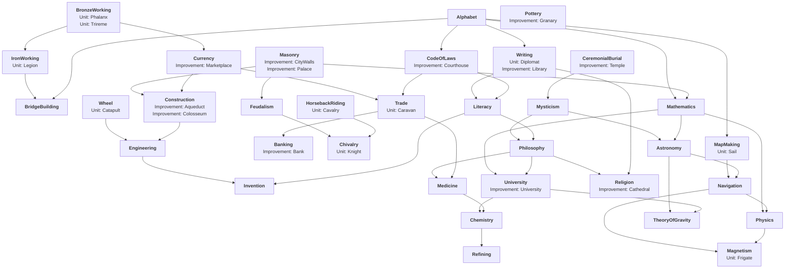

# Technology Tree

```mermaid
flowchart TD
    Alphabet["<b>Alphabet</b>"]
    Astronomy["<b>Astronomy</b>"]
    Banking["<b>Banking</b><br/>Improvement: Bank"]
    BridgeBuilding["<b>BridgeBuilding</b>"]
    BronzeWorking["<b>BronzeWorking</b><br/>Unit: Phalanx<br/>Unit: Trireme"]
    CeremonialBurial["<b>CeremonialBurial</b><br/>Improvement: Temple"]
    Chemistry["<b>Chemistry</b>"]
    Chivalry["<b>Chivalry</b><br/>Unit: Knight"]
    CodeOfLaws["<b>CodeOfLaws</b><br/>Improvement: Courthouse"]
    Construction["<b>Construction</b><br/>Improvement: Aqueduct<br/>Improvement: Colosseum"]
    Currency["<b>Currency</b><br/>Improvement: Marketplace"]
    Engineering["<b>Engineering</b>"]
    Feudalism["<b>Feudalism</b>"]
    HorsebackRiding["<b>HorsebackRiding</b><br/>Unit: Cavalry"]
    Invention["<b>Invention</b>"]
    IronWorking["<b>IronWorking</b><br/>Unit: Legion"]
    Literacy["<b>Literacy</b>"]
    Magnetism["<b>Magnetism</b><br/>Unit: Frigate"]
    MapMaking["<b>MapMaking</b><br/>Unit: Sail"]
    Masonry["<b>Masonry</b><br/>Improvement: CityWalls<br/>Improvement: Palace"]
    Mathematics["<b>Mathematics</b>"]
    Medicine["<b>Medicine</b>"]
    Mysticism["<b>Mysticism</b>"]
    Navigation["<b>Navigation</b>"]
    Philosophy["<b>Philosophy</b>"]
    Physics["<b>Physics</b>"]
    Pottery["<b>Pottery</b><br/>Improvement: Granary"]
    Refining["<b>Refining</b>"]
    Religion["<b>Religion</b><br/>Improvement: Cathedral"]
    TheoryOfGravity["<b>TheoryOfGravity</b>"]
    Trade["<b>Trade</b><br/>Unit: Caravan"]
    University["<b>University</b><br/>Improvement: University"]
    Wheel["<b>Wheel</b><br/>Unit: Catapult"]
    Writing["<b>Writing</b><br/>Unit: Diplomat<br/>Improvement: Library"]
    Mysticism --> Astronomy
    Mathematics --> Astronomy
    Trade --> Banking
    IronWorking --> BridgeBuilding
    Alphabet --> BridgeBuilding
    University --> Chemistry
    Medicine --> Chemistry
    Feudalism --> Chivalry
    HorsebackRiding --> Chivalry
    Alphabet --> CodeOfLaws
    Masonry --> Construction
    Currency --> Construction
    BronzeWorking --> Currency
    Wheel --> Engineering
    Construction --> Engineering
    Masonry --> Feudalism
    Engineering --> Invention
    Literacy --> Invention
    BronzeWorking --> IronWorking
    Writing --> Literacy
    CodeOfLaws --> Literacy
    Navigation --> Magnetism
    Physics --> Magnetism
    Alphabet --> MapMaking
    Alphabet --> Mathematics
    Masonry --> Mathematics
    Philosophy --> Medicine
    Trade --> Medicine
    CeremonialBurial --> Mysticism
    MapMaking --> Navigation
    Astronomy --> Navigation
    Mysticism --> Philosophy
    Literacy --> Philosophy
    Mathematics --> Physics
    Navigation --> Physics
    Chemistry --> Refining
    Philosophy --> Religion
    Writing --> Religion
    Astronomy --> TheoryOfGravity
    University --> TheoryOfGravity
    Currency --> Trade
    CodeOfLaws --> Trade
    Mathematics --> University
    Philosophy --> University
    Alphabet --> Writing
```
