# 1 — Architecture / package diagram

Layering from `ARCHITECTURE.md` and `src/lib.rs`. Arrows are dependencies /
data flow, not ownership. `model` never references `game_engine` (hard boundary).

```mermaid
flowchart TB
    subgraph TUI["tui — terminal UI"]
        App["App<br/>(event loop + selection state)"]
        GameScreen["GameScreen<br/>(ratatui Widget)"]
        Dialogs["dialogs / pickers<br/>(splash, civ/competition/difficulty,<br/>city_window, production/work,<br/>research, diplomacy, save_load)"]
    end

    subgraph ENG["game_engine — simulation"]
        Engine["Engine<br/>(submit + turn counter + rng + motion)"]
        GameViewI["GameView trait<br/>(read-only view)"]
        Concerns["movement / combat / cities<br/>diplomacy / research / turns<br/>rival_player_engine / calendar"]
        Save["save<br/>(SaveData / LoadedGame)"]
    end

    subgraph MOD["model — pure data + rules"]
        Carto["cartography<br/>(Map, Tile, Location, Direction,<br/>generation/MapGenerator)"]
        Units["units<br/>(Unit, UnitClass, UnitOrder, UnitId)"]
        Cities["cities<br/>(City, CityImprovement,<br/>ProductionTarget, CityTick, CityId)"]
        Civs["civilizations<br/>(Civilization, Ruler, PlayerId)"]
        Geo["geography<br/>(Terrain, TerrainImprovement,<br/>SpecialResource, MovementCategory)"]
        Adv["advancements<br/>(Advancement x34)"]
        Meta["competition / difficulty"]
    end

    subgraph UTL["utils — plumbing"]
        Rng["Rng<br/>(xorshift, Serialize)"]
    end

    App -- "submit(Command)" --> Engine
    Engine -- "Vec(Event)" --> App
    GameScreen -. "reads &dyn GameView" .-> GameViewI
    Dialogs -. "reads &dyn GameView" .-> GameViewI
    Engine -- "implements" --> GameViewI
    Engine --> Concerns
    Engine --> Save
    Engine --> MOD
    App --> MOD
    GameScreen --> MOD
    ENG -. "MapGenerator::with_rng()" .-> Rng
    App -. "draw rivals only" .-> Rng

    style MOD fill:#1a2b1a,stroke:#6a6,stroke-width:2px
    style ENG fill:#1a1a2e,stroke:#88f,stroke-width:2px
    style TUI fill:#2e1a1a,stroke:#f88,stroke-width:2px
    style UTL fill:#222,stroke:#aaa,stroke-width:1px
```

## Notes

- `Engine::submit` is the only mutation path; the TUI never mutates game state directly.
- `GameView` is implemented by `Engine` (`engine_view.rs`) and borrowed as `&dyn GameView` by every widget.
- `model` has no `Game`/`Player` aggregate — those live in `game_engine` (`game.rs`, `player.rs`).
- `utils::Rng` is the only RNG. The rival AI never draws from `Engine.rng`, so the combat stream is untouched.
