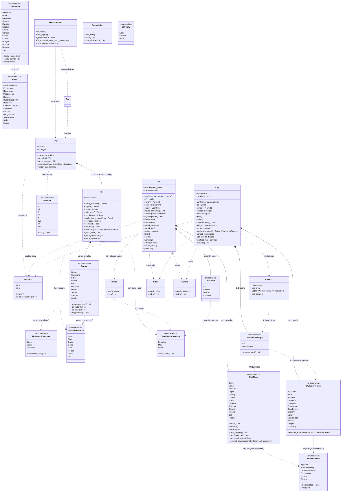

# 2 — `model` domain class diagram

Source: `src/model/**`. `model/mod.rs` is a facade only. Entities are linked by
small index-backed ID values (`UnitId`, `CityId`, `PlayerId`) resolved by linear
scan — no pointers, no hash maps. `MapGenerator` is the only type that touches
`utils::Rng` (outside `model`).

> `Advancement` shows 6 of 34 variants for brevity; the full list
> (`Alphabet` … `Writing`) is in `src/model/advancements/advancement.rs`.
> `City.worked` always includes the centre tile; max 21 tiles (radius-2 diamond
> minus corners) — see `Game::city_footprint` in `game_engine`.
