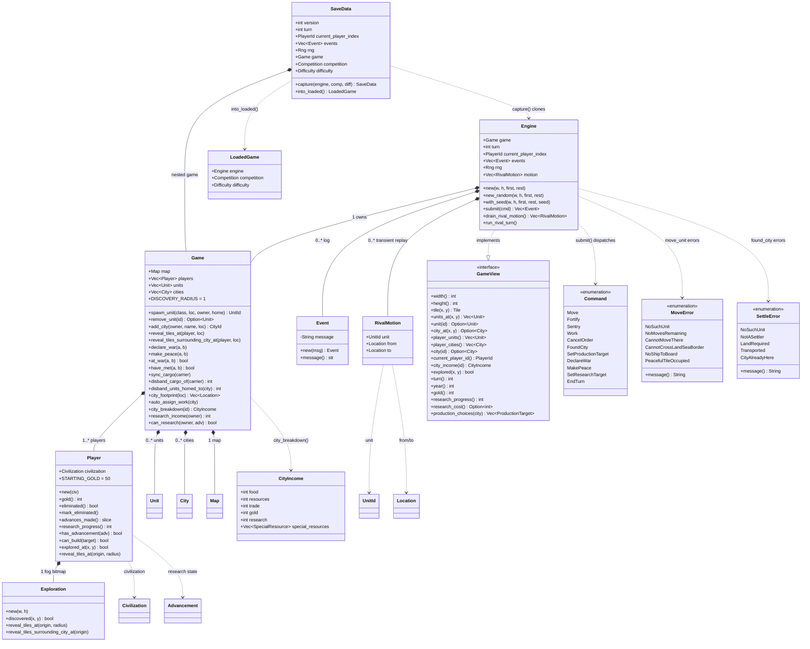

# 3 — `game_engine` class diagram

Source: `src/game_engine/*.rs`. Facade `mod.rs` re-exports `Engine`,
`GameView`, `Command`, `Player`, `Event`, `MoveError`, `SettleError`,
`Exploration`, `CityIncome`, `RivalMotion`, `DEFAULT_MAP_WIDTH/HEIGHT`.
One `impl Engine` block per concern file (`movement.rs`, `combat.rs`,
`cities.rs`, `diplomacy.rs`, `research.rs`, `turns.rs`).

## Dispatch table (`Engine::submit` → concern module)

| `Command` | Owner file | Key callees |
|---|---|---|
| `Move` | `movement.rs` | `try_board`, `meet_contacts_within`, `resolve_move_combat` (`combat.rs`), `capture_city` (`combat.rs`) |
| `Fortify` / `Sentry` / `Work` / `CancelOrder` | `movement.rs` | `owned_unit_mut`, terrain `supports()` gates |
| `FoundCity` / `SetProductionTarget` | `cities.rs` | `Game::add_city`, `auto_assign_work`, `player.can_build` |
| `DeclareWar` / `MakePeace` | `diplomacy.rs` | `Game::declare_war` / `make_peace` |
| `SetResearchTarget` | `research.rs` | `Game::can_research`, `set_research_target` |
| `EndTurn` | `turns.rs` + `rival_player_engine.rs` | `advance_to_next_player`, `begin_turn`, `run_rival_turn`, `drain_rival_motion` |

`Engine.motion` is transient: rebuilt fresh in `into_loaded`, never serialized into `SaveData`.
