# 4 — `tui` class diagram

Source: `src/tui/**` + `src/main.rs`. `tui/mod.rs` is a facade; `app/mod.rs`
is the hub (`App` struct + event loop + drawing) with concern siblings
(`setup.rs`, `playing.rs`, `mouse.rs`, `dialogs.rs`, `pickers.rs`).
Every render widget reads only through `&dyn GameView` — never `Engine` directly.

```mermaid
classDiagram
    class App {
        -Phase phase
        -Option~Engine~ engine
        -Option~UnitId~ selected_unit
        -Option~CityId~ selected_city
        -Cell~tuple~ camera
        -Cell~bool~ camera_follow
        -Vec~GameEvent~ event_log
        -Option~ResearchDialogState~ research_dialog
        -Option~DiplomacyState~ diplomacy
        -Option~SaveLoadState~ save_prompt
        -bool production_picker_open
        -bool command_picker_open
        -Option~BattleAnimation~ battle_animation
        -Option~RivalMoveAnimation~ rival_animation
        +new() App
        +run(term) Result
        +draw(frame, app)
        +handle_key(key) bool
        +handle_mouse(m)
        +handle_playing_key(key) bool
        +move_selected_unit(dir)
        +found_selected_city()
        +end_turn()
        +record_events(events)
        +start_game()
        +enter_playing()
    }
    class Phase {
        <<enumeration>>
        Menu
        ChoosingCiv
        ChoosingCompetition
        ChoosingDifficulty
        ReadyToStart
        Playing
    }
    class GameScreen {
        +&GameView view
        +Option~tuple~ focus
        +tuple camera
        +Option~UnitId~ selected_unit
        +Option~CityId~ selected_city
        +bool show_events
        +&slice events
        +render(area, buf)
        +draw_main_map()
        +draw_minimap()
        +draw_player_stats()
        +draw_focus()
        +draw_event_log()
    }
    class BattleAnimation {
        +Location location
        +Duration start
        +glyph(now) Option~str~
    }
    class RivalMoveAnimation {
        +Duration start
        +Vec~RivalMoveFrame~ frames
        +is_complete(now) bool
        +hidden_units(now) HashSet~UnitId~
        +active_frame(now) Option
    }
    class CityWindow {
        +&GameView view
        +CityId city
        +int scroll
        +window_rect() Rect
        +close_button_rect() Rect
    }
    class ProductionPicker {
        +&GameView view
        +CityId city
        +int cursor_col
        +int cursor_row
        +pick_rows() Vec~PickRow~
        +target_at(i) Option~ProductionTarget~
    }
    class CommandPicker {
        +&GameView view
        +UnitId unit
        +available_commands() Vec~CommandChoice~
        +label() String
    }
    class ResearchDialog {
        +Advancement discovered
        +Vec~Advancement~ choices
        +int cursor
    }
    class DiplomacyDialog {
        +PlayerId opponent
        +DiplomacyOrigin origin
        +DiplomacyChoice choice
    }
    class SaveLoadPrompt {
        +SaveLoadKind kind
        +String input
        +Option~String~ error
    }
    class SplashScreen {
        +new() SplashScreen
    }
    class CivSelector {
        +int selected
        +Option~Civilization~ chosen
    }
    class CompetitionSelector {
        +int selected
        +Option~Competition~ chosen
    }
    class DifficultySelector {
        +int selected
        +Option~Difficulty~ chosen
    }
    class StartConfirm {
        +Civilization civ
        +Competition competition
        +Difficulty difficulty
    }
    class StatusBar {
        +float progress
        +int selected
    }
    class PlayingHelp {
        +commands slice
    }

    App *-- Phase : current phase
    App *-- Engine : 0..1 active match
    App *-- BattleAnimation : 0..1 flash overlay
    App *-- RivalMoveAnimation : 0..1 replay overlay
    App ..> GameScreen : constructs per frame
    App ..> CityWindow : opens on selection
    App ..> ProductionPicker : opens on city
    App ..> CommandPicker : opens on a unit
    App ..> ResearchDialog : opens on discovery
    App ..> DiplomacyDialog : opens on contact/block
    App ..> SaveLoadPrompt : S key / menu load
    App ..> SplashScreen : Menu phase
    App ..> CivSelector : ChoosingCiv phase
    App ..> CompetitionSelector : ChoosingCompetition phase
    App ..> DifficultySelector : ChoosingDifficulty phase
    App ..> StartConfirm : ReadyToStart phase
    GameScreen ..> GameView : reads &dyn
    CityWindow ..> GameView : reads &dyn
    ProductionPicker ..> GameView : reads &dyn
    CommandPicker ..> GameView : reads &dyn
    ResearchDialog ..> GameView : reads &dyn
    GameScreen *-- BattleAnimation : 0..1 paints 💥 topmost
    GameScreen ..> RivalMoveAnimation : 0..1 replays steps
    RivalMoveAnimation *-- RivalMotion : frames from drain
```

## Render z-order (`GameScreen::render`)

1. Per-tile pass (`tiles.rs::paint_tile`) — terrain, city colour wash, unit glyphs.
   Units with replay frames still to play are in `hidden_units` and skipped here.
2. City-name labels (collected during pass 1, drawn after so rows below survive).
3. Transient overlays on top: battle flash `💥` (anchored in tile left column),
   rival-move glyph (owner civilisation colour, `BOLD+UNDERLINED`), hover `▓`.

City tiles always wear the owner civilisation colour even under an occupying unit.
