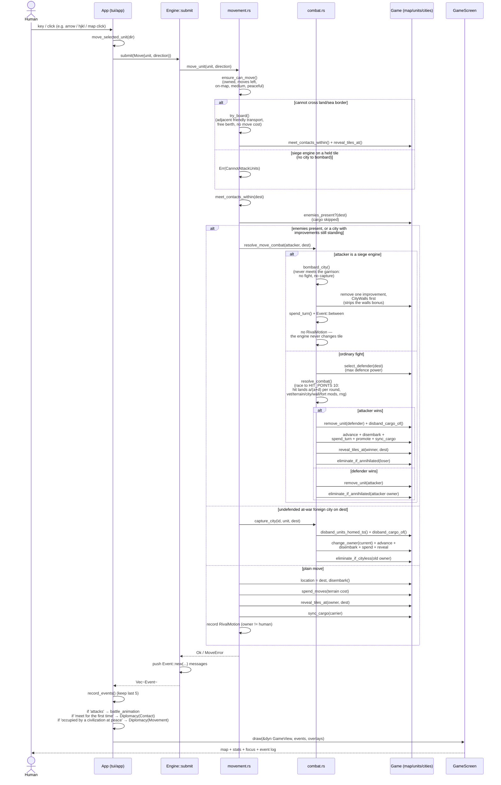

# 5 — Command flow sequence diagram

One keystroke/mouse action → one `Command` → `Engine::submit` → `Vec<Event>` →
`App::record_events` + overlay triggers → next `GameScreen` frame. Shown here is
the richest path: a combat move (`movement.rs` → `combat.rs`), including the
city-capture early return and the reveal invariant. The combat tail has two
shapes: an ordinary fight, and a siege engine's bombardment, which never meets
the garrison at all. A rival attack takes this same path (after its
`declare_war`): its landing is recorded as a `RivalMotion { battle: true }`
before the fight resolves, so the replay can flash the tile it struck. A
bombardment records nothing, because the engine never changes tile.

## Invariants on this path

- Every tile landing reveals for the mover (`reveal_tiles_at`); combat advances
  and captures reveal for themselves (separate early returns).
- Movement spends the terrain cost (`spend_moves(cost)`), never `spend_turn()`;
  only combat/capture spend the whole turn. Boarding/disembarking cost nothing
  but still reveal.
- Cargo is inert: omitted from `units_at`, skipped by `select_defender` /
  `enemies_present` / `ensure_peaceful_passage`.
- `UnitClass::attacks_units` / `sieges` split the two tail shapes. A siege
  engine is routed to the tail whenever the destination holds an enemy city
  **with improvements standing** — otherwise an undefended but walled city
  would change hands without a shot. With the city stripped and no soldiers on
  it, it falls through to the ordinary capture path instead: it cannot fight
  its way in, but it need not once nothing is left to defend.
- `bombard_city` spends the whole turn on one improvement, `CityWalls` first.
  Stripping the walls removes `CITY_WALLS_DEFENSE_BONUS` from every defender in
  the city, which is the point: a losing attacker is removed outright and no
  wound state survives between fights, so a defended city cannot be ground
  down by attrition.
- Fortify / Sentry / Work / CancelOrder / FoundCity / SetProductionTarget /
  DeclareWar / MakePeace / SetResearchTarget follow the same
  `App → submit → concern → Events → record → draw` skeleton with their own
  guards (see `03-engine-structure.md` dispatch table).
