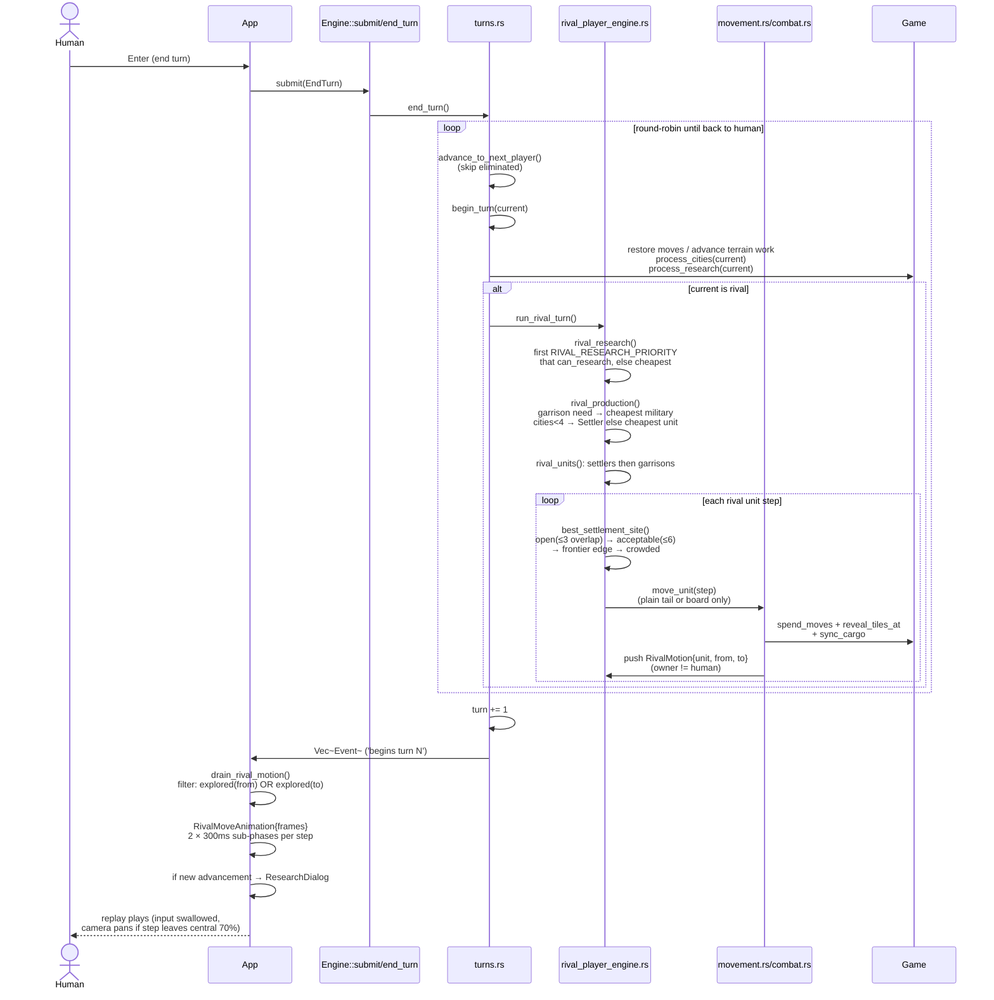

# 6 — Turn loop / rival AI sequence diagram

`Command::EndTurn` resolves the whole round on the engine (`turns.rs` +
`rival_player_engine.rs`): each rival acts in player order, then control returns
to the human and the turn increments once. The AI is deterministic — it never
draws from `Engine.rng` — and every rival step goes through the ordinary
`move_unit` path, so movement/reveal/transport/combat invariants hold and each
landing is recorded as `RivalMotion` for the TUI replay.

## Settlement tiers (`best_settlement_site`)

Measured against the union of **all** civilisations' 21-tile working grids, deterministic
(best score → nearest to settler → smallest tile):

1. **Open** — shares at most 3 tiles (≥ Chebyshev 4 off every city).
2. **Acceptable** — shares at most 6 tiles (≥ Chebyshev 3 out).
3. **Frontier** — nearest explored land tile bordering unexplored ground, so reveals open new country.
4. **Crowded** — best-scored tile, only when the map is fully explored.

Sites are only ever chosen from explored tiles. Score is `2 × resources + food`.
