# 7 — `App` state machine

Source: `src/tui/app/mod.rs` (`Phase`), `setup.rs`, `playing.rs`, `dialogs.rs`,
`pickers.rs`, `mouse.rs`. `App::draw` matches `phase`; `handle_key` dispatches
per phase. `Playing` keeps modal priority: save prompt swallows everything, then
research → war notice → diplomacy → command picker → production picker →
rival replay.

```mermaid
stateDiagram-v2
    state "App::new()" as Menu
    [*] --> Menu

    Menu --> ChoosingCiv : N / Enter (New Game)
    Menu --> Menu : L (Load Saved Game → SaveLoadPrompt.Load)
    Menu --> [*] : Q / Quit

    ChoosingCiv --> ChoosingCompetition : Enter (civ chosen)
    ChoosingCiv --> Menu : Esc / q

    ChoosingCompetition --> ChoosingDifficulty : Enter (rivals 1..7)
    ChoosingCompetition --> ChoosingCiv : Esc

    ChoosingDifficulty --> ReadyToStart : Enter (Easy/Normal/Hard)
    ChoosingDifficulty --> ChoosingCompetition : Esc

    ReadyToStart --> Playing : S / Enter (start_game())
    ReadyToStart --> ChoosingDifficulty : Esc
    ReadyToStart --> [*] : Q (Quit)

    state Playing {
        [*] --> Exploring
        Exploring --> CityWindowOpen : select city (click / key)
        CityWindowOpen --> ProductionPickerOpen : change production
        ProductionPickerOpen --> CityWindowOpen : save / cancel
        CityWindowOpen --> Exploring : close (Esc / ✕ / click outside)

        Exploring --> CommandPickerOpen : w on a unit / click a unit
        CommandPickerOpen --> Exploring : save order / cancel

        Exploring --> ResearchDialogOpen : advancement discovered
        ResearchDialogOpen --> Exploring : confirm SetResearchTarget

        Exploring --> DiplomacyOpen : first contact / peaceful-block
        DiplomacyOpen --> Exploring : DeclareWar (+retry move) / MakePeace / cancel

        Exploring --> WarNoticeOpen : EndTurn → drain_rival_wars()
        WarNoticeOpen --> Exploring : Enter / Space / Esc (OK); next queued war reopens

        Exploring --> SavePromptOpen : S (save) 
        SavePromptOpen --> Exploring : save_game() / cancel

        Exploring --> RivalReplay : EndTurn → drain_rival_motion()
        RivalReplay --> Exploring : animation complete
    }

    Playing --> Menu : q (quit to menu, via confirm path)
    Playing --> Playing : Enter (EndTurn, stays in Playing)
```

## Modal input priority (`handle_playing_key` / `handle_mouse`)

1. `save_prompt` open → all keys/mouse go to the prompt (checked first in `handle_key`).
2. `game_over` set → only `handle_game_over_key` / `handle_game_over_mouse` — the
   EndTurn outcome overlay, no `Phase` change. Save prompt and game-over never both open.
3. `quit_dialog` open → quit dialog keys/mouse only.
4. `research_dialog` → research keys only.
5. `war_notice` → Enter/Space/Esc acknowledges (clicks the OK button) and
   pops the next queued `RivalWar` declaration, if any.
6. `build_notice` (not suspended) → Enter/Space/Esc acknowledges (OK, moves to
   the next city that finished), `n` opens that city's own window instead.
   A window opened this way parks the notice, as does the `research_dialog`
   when the same round advances a technology; closing the city window, or
   confirming the research choice, resumes the loop.
8. `diplomacy` → diplomacy keys only.
9. `command_picker_open` → command picker keys only.
10. `production_picker_open` → production picker keys only (floats over the
    city window, which is why its guard comes first).
11. `selected_city` set (city window open) → Esc closes it; every other key is
    inert, so no map command reaches the tile under the panel. A press inside
    the window acts on its buttons, a press outside dismisses the window and is
    consumed rather than becoming a drag or a click on the map.
12. `rival_animation` active → swallows game input (modals still capture), pans camera.
12. Otherwise: unit keys (`arrows/hjkl/yubn`, `Tab` cycle, `space` sentry-wait),
    `v` found city, `w` command window, `c` cancel order, `e` toggle events, `?` help,
    `S` save, `Enter` end turn, `Esc` deselect/close.

`SaveLoadPrompt` renders topmost in every phase (`draw` paints it last).
Default save path is `civterm.civ`.
